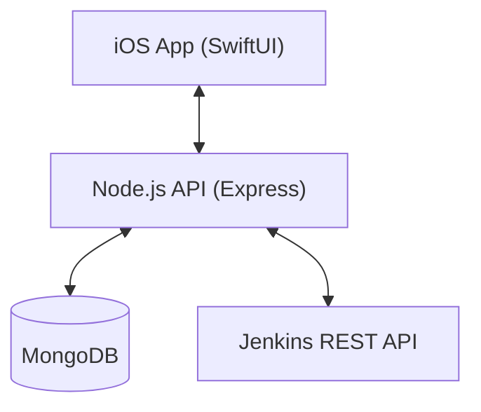

# 🚀 JobTrigger

> **Trigger Jenkins builds from anywhere — An iOS app for DevOps engineers**

[](https://developer.apple.com/ios/)
[](https://swift.org/)
[](https://developer.apple.com/xcode/swiftui/)
[](LICENSE)

---

## 🎯 Product Vision

JobTrigger enables developers and DevOps engineers to securely trigger, monitor, and manage Jenkins jobs directly from an iOS device—anytime, anywhere.

## ✨ Features

- 🔐 **Secure Authentication** — Node.js backend with JWT and iOS Keychain storage
- 📱 **Backend Sync** — Credentials and user data persisted in MongoDB
- 📋 **Job Management** — View, search, and organize Jenkins jobs
- 🚀 **One-Tap Trigger** — Start builds instantly
- ⚙️ **Build Parameters** — Pass parameters before triggering
- 📊 **Real-Time Status** — Monitor build progress
- 📄 **Build Logs** — View console output
- 🌙 **Dark Mode** — Easy on the eyes
- 🌐 **Offline Resilience** — Connectivity monitoring and proactive error alerts

## 🏗️ Architecture



## 🛠️ Tech Stack

| Layer | Technology |
|-------|------------|
| Language | Swift 5.10 |
| UI | SwiftUI |
| Networking | URLSession (BackendClient) |
| Backend | Node.js (Express) |
| Database | MongoDB |
| Security | JWT + iOS Keychain |

## 📱 Requirements

- iOS 17.0+
- Node.js 18.x+ (for backend)
- MongoDB
- Jenkins 2.x with REST API enabled

## 🏃 Getting Started

### 1. Start the Backend

Navigate to the backend directory and start the server:

```bash
cd lab-trigger-backend
npm install
npm run dev
```

### 2. Launch iOS App

Run the `Lab-Trigger-frontend` in Xcode. The app will automatically connect to `http://127.0.0.1:5001`.

### 3. Create an Account

- **Email**: Must be a valid email format.
- **Password**: Must be at least **6 characters**.
- Data is stored securely in MongoDB.

## 🚦 Project Status

| Phase | Status | Timeline |
|-------|--------|----------|
| Discovery & Planning | 🟢 Complete | Feb 2026 |
| Logic & Architecture | 🟢 Complete | Feb 2026 |
| Backend Migration | 🟢 Complete | Feb 2026 |
| UI Refinement | 🟢 Complete | Feb 2026 |
| Release | ⚪ Pending | Mar 2026 |

## 👥 Target Users

- **DevOps Engineers** — Trigger pipelines on the go
- **Backend Engineers** — Quick access to build status
- **Team Leads** — Visibility before releases
- **Release Managers** — Approve and deploy

## 🔐 Security

- **JWT Authentication** — Secure stateless sessions
- **iOS Keychain** — Encryption for sensitive tokens
- **Bcrypt** — Industry-standard password hashing
- **TLS Enforcement** — Secure data in transit

## 📄 License

This project is licensed under the MIT License - see the [LICENSE](LICENSE) file for details.

---

*Made with ❤️ for the DevOps community*
