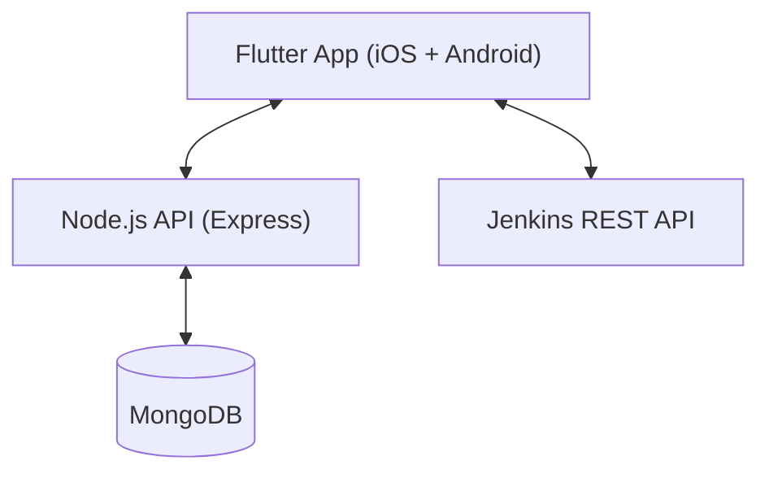

# 🚀 JobTrigger

> **Trigger Jenkins builds from anywhere — a Flutter app for DevOps engineers (iOS + Android)**

<p align="center">
  
  
  
  
  
  
  
  
</p>

---

## 🎯 Product Vision

JobTrigger enables developers and DevOps engineers to securely trigger, monitor, and manage Jenkins jobs directly from their phone—anytime, anywhere.

> **Note:** this app started as a SwiftUI/iOS-only client (`Lab-Trigger-frontend`) and has since been fully rewritten in Flutter (`JobTrigger-Frontend/`) for iOS + Android, using a layered Clean Architecture with Riverpod. See [`CLAUDE.md`](CLAUDE.md) and [`docs/`](docs/) for the full architecture and migration record. The Node.js/MongoDB backend (`JobTrigger-Backend/`) was kept as-is throughout the rewrite.

## ✨ Features

- 🔐 **Secure Authentication** — Node.js backend with JWT, stored via `flutter_secure_storage` (iOS Keychain / Android Keystore)
- 📱 **Backend Sync** — Credentials and user data persisted in MongoDB
- 📋 **Job Management** — Recursive job/folder tree, breadcrumb navigation, live search
- 🚀 **One-Tap Trigger** — Start builds instantly, with or without parameters (string/choice/boolean)
- 📊 **Real-Time Status** — Live build status polling with a progress bar, cancel a running build
- 📄 **Build Logs** — Progressive console log streaming, performant at thousands of lines
- 🕒 **History** — Global cross-job history and per-job build history
- 🌙 **Theme** — System / light / dark, switchable in Settings
- 🌐 **Offline Resilience** — Clear connection-error states with retry, on both the backend and Jenkins requests

## 🏗️ Architecture


```mermaid
graph TD
    Flutter["Flutter App (iOS + Android)"] <--> API["Node.js API (Express)"]
    API <--> MongoDB[("MongoDB")]
    Flutter <--> Jenkins["Jenkins REST API"]
```

Flutter talks to two independent APIs with different auth schemes: the
Node.js backend (JWT bearer, for accounts + saved Jenkins credentials) and
Jenkins servers directly (HTTP Basic Auth, no backend proxy). See
[`docs/api-reference.md`](docs/api-reference.md).

## 🛠️ Tech Stack

| Layer | Technology |
|-------|------------|
| Language / SDK | Dart 3.x / Flutter (stable channel) |
| State management | `flutter_riverpod` v3 (code-gen via `riverpod_generator`) |
| Networking | `dio` |
| Routing | `go_router` |
| Models / JSON | `freezed` + `json_serializable` |
| Secure storage | `flutter_secure_storage` (JWT + Jenkins credentials) |
| Backend | Node.js (Express) |
| Database | MongoDB |

Full locked-dependency table (and the reasoning behind each choice) lives in
[`CLAUDE.md §3`](CLAUDE.md).

## 📱 Requirements

- Flutter SDK (stable channel) — `flutter --version` to check
- **For iOS**: a Mac with Xcode (full app, not just Command Line Tools) and
  [CocoaPods](https://cocoapods.org) installed (`sudo gem install cocoapods`
  or `brew install cocoapods`)
- For Android: Android Studio + an emulator/device
- Node.js 18.x+ (for the backend)
- MongoDB (local via Docker, or a MongoDB Atlas connection string)
- Jenkins 2.x with REST API enabled (only needed once you get past login —
  see [Create an Account](#4-create-an-account) below)

Run `flutter doctor` after installing the above — it flags missing Xcode
license acceptance, CocoaPods, or simulator components before you try to run
the app.

## 🏃 Getting Started

There are two ways to bring up the backend: the one-shot script
(`setup-dev.sh`), or the manual steps below. Either way, do the [iOS
Simulator](#2-initialize-the-ios-simulator) and [Flutter app](#3-start-the-flutter-app)
steps afterwards.

### 1. Start the Backend + Database

**Option A — one-shot script** (seeds the dev user + sample Jenkins
credentials automatically, see [`docs/dev-setup.md`](docs/dev-setup.md)):

```bash
./setup-dev.sh                 # uses MongoDB Cloud (Atlas) — needs MONGODB_URI in JobTrigger-Backend/.env
USE_DOCKER=true ./setup-dev.sh # or: spin up local MongoDB via Docker instead
```

This blocks the terminal running the backend in watch mode — leave it
running and use a new terminal tab for the steps that follow. Stop it later
with `Ctrl+C` then `./stop-dev.sh`.

**Option B — manual steps:**

```bash
# 1a. Start MongoDB (skip if using MongoDB Atlas — set MONGODB_URI in .env instead)
docker compose up -d

# 1b. Install deps and start the backend
cd JobTrigger-Backend
npm install
npm run dev
```

`docker compose up -d` starts a `mongo:8` container on `localhost:27017`
(matching `JobTrigger-Backend/.env`'s `MONGODB_URI`), with data persisted in
a named Docker volume. `docker compose down` stops it (data persists);
`docker compose down -v` also wipes the volume.

The backend listens on `http://127.0.0.1:5001` by default. Confirm it's up:

```bash
curl http://localhost:5001/api/appinfo
```

### 2. Initialize the iOS Simulator

Skip this section if you're targeting Android — use an Android Studio
emulator or physical device instead.

```bash
# Check for simulators you already have (most Macs with Xcode installed
# already have one, e.g. "iPhone Air" — skip straight to booting it below)
xcrun simctl list devices available

# No simulator yet? See what device types + runtimes you can create from:
xcrun simctl list devicetypes | grep -i iphone
flutter emulators

# Create a simulator once (only needed the first time — pick a device type
# from the list above and an installed runtime, e.g. "iOS 26.5")
xcrun simctl create "iPhone Air" \
  com.apple.CoreSimulator.SimDeviceType.iPhone-Air \
  com.apple.CoreSimulator.SimRuntime.iOS-26-5

# Boot it and open Simulator.app
open -a Simulator
xcrun simctl boot "iPhone Air"   # no-op / harmless if it's already booted
```

Alternatively, open Xcode → **Window → Devices and Simulators** to create or
boot a simulator with a GUI instead of `simctl`. Once a simulator is booted,
confirm Flutter can see it:

```bash
flutter devices
```

### 3. Start the Flutter App

```bash
cd JobTrigger-Frontend
flutter pub get
dart run build_runner build --delete-conflicting-outputs
flutter run --dart-define-from-file=config/dev.json -d "iPhone Air"   # or your device's -d id from `flutter devices`
```

> **Device names with spaces must be quoted** (e.g. `"iPhone Air"`), otherwise
> the shell splits them into separate arguments and Flutter misreads the
> extra word as a target file (`Target file "Air" not found.`). Example:
> ```bash
> flutter run --dart-define-from-file=config/dev.json -d "iPhone Air"
> ```
> Or run `flutter run` with no `-d` flag to pick the booted simulator
> interactively.

`config/dev.json` points the app at `http://127.0.0.1:5001` — see
[`JobTrigger-Frontend/config/README.md`](JobTrigger-Frontend/config/README.md) for the
staging/prod variants. Re-run the `build_runner` command any time you edit a
`@freezed`/`@riverpod`/`@JsonSerializable` class.

Useful day-to-day commands (from `JobTrigger-Frontend/`):

```bash
flutter analyze   # must be clean before a PR
flutter test      # run the unit/widget test suite
```

### 4. Create an Account

- **Email**: Must be a valid email format.
- **Password**: Must be at least **6 characters**.
- Data is stored securely in MongoDB.

**Local dev account** (seeded by `JobTrigger-Backend/scripts/setup-migrations.js`
— not a real/production credential, just a login for local testing):

| Email | Password |
|-------|----------|
| `developer@jobtrigger.app` | `SecurePassword123!` |

If your local/cloud MongoDB is empty (e.g. fresh clone or a wiped database),
this account won't exist yet — sign up with any email/password from the
app's Sign Up screen, or re-run the migration script:

```bash
cd JobTrigger-Backend
node scripts/setup-migrations.js
```

See [`docs/database-migrations.md`](docs/database-migrations.md) for what
this script seeds.

## 🚦 Project Status

Tracked per-phase in [`tasks/README.md`](tasks/README.md). Summary:

| Phase | Status |
|-------|--------|
| 0 — Setup | 🟢 Done |
| 1 — Core infrastructure | 🟢 Done |
| 2 — Auth + tool selection | 🟡 Blocked — code complete, pending a real-device relaunch check |
| 3 — Credentials management | 🟢 Done |
| 4 — Jenkins job tree | 🟢 Done |
| 5 — Build execution, logs, history | 🟢 Done |
| 6 — Polish + release | 🟡 Blocked — app icon artwork and store submission still needed |

Not yet released to the App Store / Play Store.

## 👥 Target Users

- **DevOps Engineers** — Trigger pipelines on the go
- **Backend Engineers** — Quick access to build status
- **Team Leads** — Visibility before releases
- **Release Managers** — Approve and deploy

## 🔐 Security

- **JWT Authentication** — Secure stateless sessions
- **Secure Storage** — JWT and Jenkins credentials encrypted via `flutter_secure_storage` (iOS Keychain / Android Keystore)
- **Bcrypt** — Industry-standard password hashing
- **TLS Enforcement** — Secure data in transit

## 📄 License

This project is licensed under the MIT License - see the [LICENSE](LICENSE) file for details.

---

*Made with ❤️ for the DevOps community*
