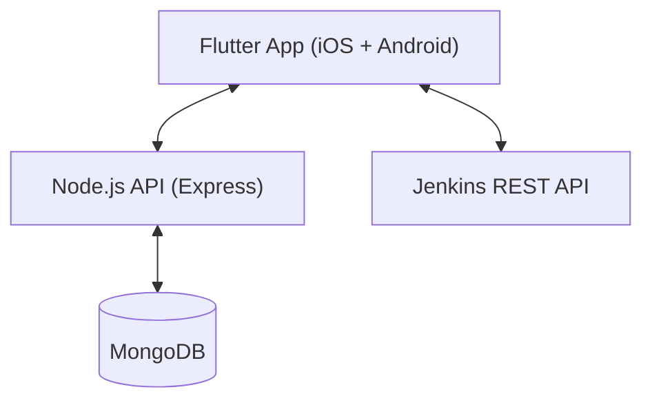

# 🚀 JobTrigger

> **Trigger Jenkins builds from anywhere — a Flutter app for DevOps engineers (iOS + Android)**

<p align="center">
  
  
  
  
  
  
  
  
</p>

---

## 🎯 Product Vision

JobTrigger enables developers and DevOps engineers to securely trigger, monitor, and manage Jenkins jobs directly from their phone—anytime, anywhere.

> **Note:** this app started as a SwiftUI/iOS-only client (`Lab-Trigger-frontend`) and has since been fully rewritten in Flutter (`JobTrigger-Frontend/`) for iOS + Android, using a layered Clean Architecture with Riverpod. See [`CLAUDE.md`](CLAUDE.md) and [`docs/`](docs/) for the full architecture and migration record. The Node.js/MongoDB backend (`JobTrigger-Backend/`) was kept as-is throughout the rewrite.

## ✨ Features

- 🔐 **Secure Authentication** — Node.js backend with JWT, stored via `flutter_secure_storage` (iOS Keychain / Android Keystore)
- 📱 **Backend Sync** — Credentials and user data persisted in MongoDB
- 📋 **Job Management** — Recursive job/folder tree, breadcrumb navigation, live search
- 🚀 **One-Tap Trigger** — Start builds instantly, with or without parameters (string/choice/boolean)
- 📊 **Real-Time Status** — Live build status polling with a progress bar, cancel a running build
- 📄 **Build Logs** — Progressive console log streaming, performant at thousands of lines
- 🕒 **History** — Global cross-job history and per-job build history
- 🌙 **Theme** — System / light / dark, switchable in Settings
- 🌐 **Offline Resilience** — Clear connection-error states with retry, on both the backend and Jenkins requests

## 🏗️ Architecture


```mermaid
graph TD
    Flutter["Flutter App (iOS + Android)"] <--> API["Node.js API (Express)"]
    API <--> MongoDB[("MongoDB")]
    Flutter <--> Jenkins["Jenkins REST API"]
```

Flutter talks to two independent APIs with different auth schemes: the
Node.js backend (JWT bearer, for accounts + saved Jenkins credentials) and
Jenkins servers directly (HTTP Basic Auth, no backend proxy). See
[`docs/api-reference.md`](docs/api-reference.md).

## 🛠️ Tech Stack

| Layer | Technology |
|-------|------------|
| Language / SDK | Dart 3.x / Flutter (stable channel) |
| State management | `flutter_riverpod` v3 (code-gen via `riverpod_generator`) |
| Networking | `dio` |
| Routing | `go_router` |
| Models / JSON | `freezed` + `json_serializable` |
| Secure storage | `flutter_secure_storage` (JWT + Jenkins credentials) |
| Backend | Node.js (Express) |
| Database | MongoDB |

Full locked-dependency table (and the reasoning behind each choice) lives in
[`CLAUDE.md §3`](CLAUDE.md).

## 📱 Requirements

- Flutter SDK (stable channel) — `flutter --version` to check
- Xcode (for iOS) and/or Android Studio + an emulator/device (for Android)
- Node.js 18.x+ (for the backend)
- MongoDB
- Jenkins 2.x with REST API enabled

## 🏃 Getting Started

### 1. Start MongoDB

```bash
docker compose up -d
```

This starts a `mongo:8` container on `localhost:27017` (matching
`JobTrigger-Backend/.env`'s `MONGODB_URI`), with data persisted in a named
Docker volume. `docker compose down` stops it (data persists);
`docker compose down -v` also wipes the volume. Alternatively, run your own
local MongoDB instance on the same port.

### 2. Start the Backend

```bash
cd JobTrigger-Backend
npm install
npm run dev
```

The backend listens on `http://127.0.0.1:5001` by default.

### 3. Start the Flutter App

```bash
cd job_trigger
flutter pub get
dart run build_runner build --delete-conflicting-outputs
flutter devices                 # see what's available (simulator/emulator/physical device)
flutter run --dart-define-from-file=config/dev.json -d <device-id>
```

`config/dev.json` points the app at `http://127.0.0.1:5001` — see
[`JobTrigger-Frontend/config/README.md`](JobTrigger-Frontend/config/README.md) for the
staging/prod variants. Re-run the `build_runner` command any time you edit a
`@freezed`/`@riverpod`/`@JsonSerializable` class.

Useful day-to-day commands (from `JobTrigger-Frontend/`):

```bash
flutter analyze   # must be clean before a PR
flutter test      # run the unit/widget test suite
```

### 4. Create an Account

- **Email**: Must be a valid email format.
- **Password**: Must be at least **6 characters**.
- Data is stored securely in MongoDB.

**Local dev test account** (seeded via `POST /api/auth/signup` against a
fresh local MongoDB — not a real/production credential, just a throwaway
login for local testing):

| Email | Password |
|-------|----------|
| `test@jobtrigger.dev` | `password123` |

If your local MongoDB is empty (e.g. after `docker compose down -v` or a
fresh clone), this account won't exist yet — sign up again with any
email/password from the app's Sign Up screen, or re-seed it:

```bash
curl -X POST http://localhost:5001/api/auth/signup \
  -H "Content-Type: application/json" \
  -d '{"email":"test@jobtrigger.dev","password":"password123"}'
```

## 🚦 Project Status

Tracked per-phase in [`tasks/README.md`](tasks/README.md). Summary:

| Phase | Status |
|-------|--------|
| 0 — Setup | 🟢 Done |
| 1 — Core infrastructure | 🟢 Done |
| 2 — Auth + tool selection | 🟡 Blocked — code complete, pending a real-device relaunch check |
| 3 — Credentials management | 🟢 Done |
| 4 — Jenkins job tree | 🟢 Done |
| 5 — Build execution, logs, history | 🟢 Done |
| 6 — Polish + release | 🟡 Blocked — app icon artwork and store submission still needed |

Not yet released to the App Store / Play Store.

## 👥 Target Users

- **DevOps Engineers** — Trigger pipelines on the go
- **Backend Engineers** — Quick access to build status
- **Team Leads** — Visibility before releases
- **Release Managers** — Approve and deploy

## 🔐 Security

- **JWT Authentication** — Secure stateless sessions
- **Secure Storage** — JWT and Jenkins credentials encrypted via `flutter_secure_storage` (iOS Keychain / Android Keystore)
- **Bcrypt** — Industry-standard password hashing
- **TLS Enforcement** — Secure data in transit

## 📄 License

This project is licensed under the MIT License - see the [LICENSE](LICENSE) file for details.

---

*Made with ❤️ for the DevOps community*
