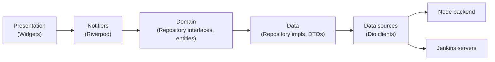

# Architecture

## 1. Why change architecture during the migration

The SwiftUI app uses a fairly standard MVVM: `View` ↔ `ViewModel`
(`ObservableObject`) ↔ `Service` (network singleton). That's fine for a
single-platform app but doesn't map cleanly onto Flutter/Riverpod, and it
mixes concerns — `JenkinsAPIService` does HTTP, JSON parsing, URL rewriting,
and polling logic in one file. The rewrite is the opportunity to separate
those concerns so each layer is independently testable and the Jenkins
integration (the highest-risk, most complex part of the app) isn't tangled
with widget lifecycle.

## 2. Layers



- **Presentation**: `Screen`/`View` widgets. Read state via `ref.watch`,
  trigger actions via `ref.read(...).method()`. No parsing, no HTTP.
- **Notifiers** (also presentation-layer, but listed separately since they're
  the thing widgets actually depend on): `AsyncNotifier`/`Notifier` classes
  that hold UI state (loading/data/error) and call into domain repositories.
  One notifier per screen or cohesive UI concern (e.g. `JobTreeNotifier`,
  `BuildLogNotifier`, `ActiveServerNotifier`).
- **Domain**: plain Dart — `JenkinsJob`, `JenkinsBuild`, `Credential`
  entities and abstract repository interfaces (`JenkinsRepository`,
  `CredentialsRepository`, `AuthRepository`). No `flutter/dio/freezed`
  imports here beyond `freezed`'s pure-Dart output if you choose to model
  entities with it. This layer is what makes business rules unit-testable
  without a widget tree or a mocked HTTP client.
- **Data**: DTOs (`@freezed` + `@JsonSerializable`, mirroring raw JSON
  shapes exactly, including Jenkins' inconsistent polymorphic fields),
  repository implementations that call data sources and map DTO → domain
  entity, and the URL-rewriting logic described in §5.
- **Data sources**: two `Dio` instances — `BackendApiClient` (JWT bearer,
  base URL from config) and a per-server `JenkinsApiClient` (Basic Auth,
  base URL = active credential's `jenkinsURL`, constructed by
  `JenkinsClientFactory` when the active server changes).

## 3. Folder-by-folder mapping from the old project

| Old (Swift/Node) | New (Flutter) |
|---|---|
| `Core/Network/BackendClient` | `core/network/backend_api_client.dart` (Dio) |
| `Core/Storage/CredentialStorageService` | `data/repositories/credentials_repository_impl.dart` |
| `Core/Network/KeychainHelper` | `core/storage/secure_storage_service.dart` |
| `Core/Auth/AuthManager` + `AuthService` | `presentation/features/auth/auth_notifier.dart` + `data/repositories/auth_repository_impl.dart` |
| `Tools/Jenkins/Services/JenkinsAPIService` | split into `data/datasources/jenkins_api_client.dart` (raw calls) + `data/repositories/jenkins_repository_impl.dart` (mapping/business rules) |
| `Tools/Jenkins/Services/ActiveServerManager` | `presentation/features/settings/active_server_notifier.dart` |
| `Tools/Jenkins/ViewModels/*` | `presentation/features/{home,job_detail,build_log,history}/*_notifier.dart` |
| `Tools/Jenkins/Models/*` | `data/models/jenkins/*.dart` (DTOs) + `domain/jenkins/*.dart` (entities) |
| `Shared/Navigation/NavBarView` | `presentation/navigation/main_scaffold.dart` + `app_router.dart` (go_router) |
| `Shared/Components/*` | `presentation/common_widgets/*` |
| `lab-trigger-backend/*` | unchanged, consumed as-is |

## 4. State management pattern

Every screen with async data follows the same shape:

```dart
@riverpod
class JobTreeNotifier extends _$JobTreeNotifier {
  @override
  Future<List<JenkinsJob>> build() async {
    final repo = ref.watch(jenkinsRepositoryProvider);
    final result = await repo.fetchJobTree();
    return result.fold(
      (failure) => throw failure, // AsyncNotifier surfaces this as AsyncError
      (jobs) => jobs,
    );
  }

  Future<void> refresh() => ref.invalidateSelf();
}
```

Widgets consume with `ref.watch(jobTreeNotifierProvider).when(data:, loading:, error:)`.
Polling screens (job detail, build log) use a secondary `Timer`-backed
notifier that calls `ref.invalidate()` on an interval and cancels itself in
`ref.onDispose`. See `docs/state-management.md` for the full provider map.

## 5. Jenkins URL normalization

Jenkins returns absolute `url` fields on jobs/builds using whatever host it
was configured with internally (e.g. `http://jenkins-internal:8080/job/x/`),
which breaks when the user reaches it via a different external host or a
tunnel. `JenkinsRepositoryImpl` rewrites the scheme+host+port of every
returned URL to match the active credential's `jenkinsURL`, preserving path
and query. This logic is unit-tested in isolation (`jenkins_repository_test.dart`)
against fixture JSON with mismatched hosts.

## 6. Error handling

Data sources throw; repositories catch and convert to a sealed
`AppFailure` (`NetworkFailure`, `AuthFailure`, `NotFoundFailure`,
`ServerFailure(statusCode)`, `UnknownFailure`). Repository methods return
`Future<Either<AppFailure, T>>` (using `fpdart`'s `Either`, or a hand-rolled
`Result<T>` if the team prefers not to add `fpdart` — pick one in Phase 1
and use it everywhere). Notifiers unwrap `Either` and rethrow the failure so
Riverpod's `AsyncError` machinery handles it; screens render failure copy
from a single `AppFailure → String` mapper so error messaging is consistent.

## 7. Background polling lifecycle

Both real-time status polling (job detail) and log streaming (build log) use
`Timer.periodic` owned by a notifier, cancelled in `ref.onDispose`. Never
start a timer from `initState`/`build()` in a widget — the notifier owns the
lifecycle so navigating away always cleans it up, matching the "gotcha"
called out in the original migration notes.
