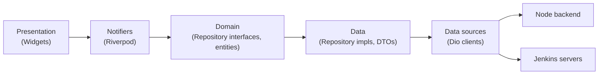
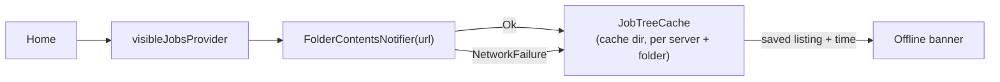
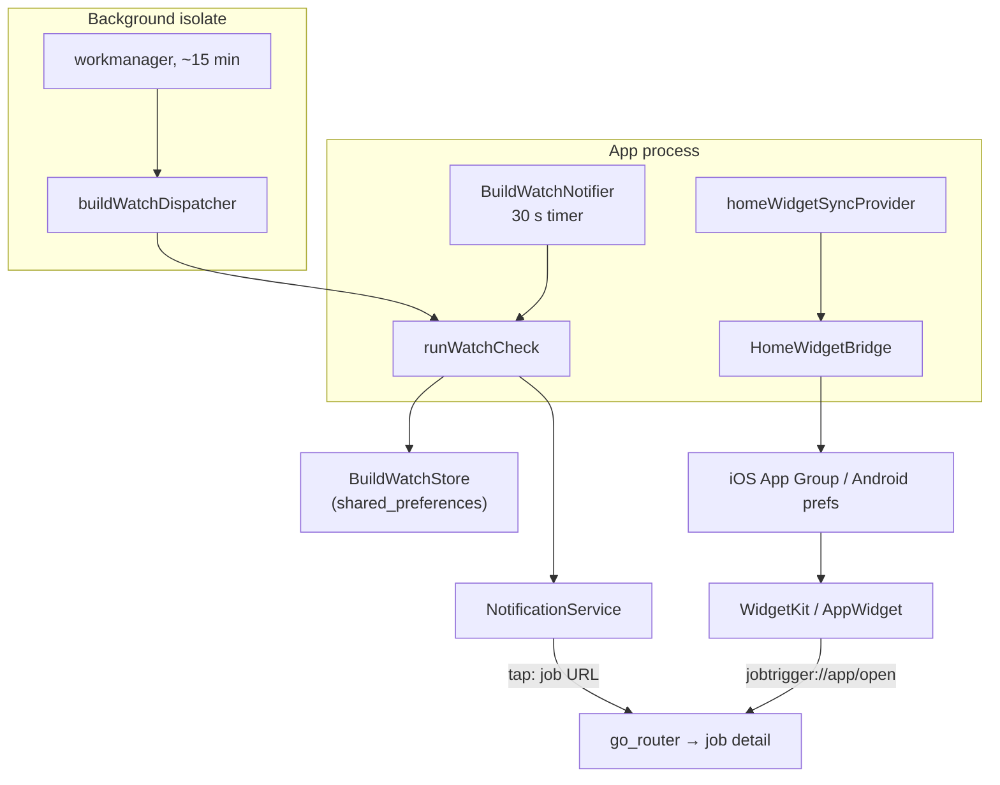

# Architecture

## 1. Why change architecture during the migration

The SwiftUI app uses a fairly standard MVVM: `View` ↔ `ViewModel`
(`ObservableObject`) ↔ `Service` (network singleton). That's fine for a
single-platform app but doesn't map cleanly onto Flutter/Riverpod, and it
mixes concerns — `JenkinsAPIService` does HTTP, JSON parsing, URL rewriting,
and polling logic in one file. The rewrite is the opportunity to separate
those concerns so each layer is independently testable and the Jenkins
integration (the highest-risk, most complex part of the app) isn't tangled
with widget lifecycle.

## 2. Layers


```mermaid
graph LR
    UI["Presentation<br/>(Widgets)"] --> N["Notifiers<br/>(Riverpod)"]
    N --> R["Domain<br/>(Repository interfaces, entities)"]
    R --> I["Data<br/>(Repository impls, DTOs)"]
    I --> DS["Data sources<br/>(Dio clients)"]
    DS --> Backend["Node backend"]
    DS --> Jenkins["Jenkins servers"]
```

- **Presentation**: `Screen`/`View` widgets. Read state via `ref.watch`,
  trigger actions via `ref.read(...).method()`. No parsing, no HTTP.
- **Notifiers** (also presentation-layer, but listed separately since they're
  the thing widgets actually depend on): `AsyncNotifier`/`Notifier` classes
  that hold UI state (loading/data/error) and call into domain repositories.
  One notifier per screen or cohesive UI concern (e.g. `JobTreeNotifier`,
  `BuildLogNotifier`, `ActiveServerNotifier`).
- **Domain**: plain Dart — `JenkinsJob`, `JenkinsBuild`, `Credential`
  entities and abstract repository interfaces (`JenkinsRepository`,
  `CredentialsRepository`, `AuthRepository`). No `flutter/dio/freezed`
  imports here beyond `freezed`'s pure-Dart output if you choose to model
  entities with it. This layer is what makes business rules unit-testable
  without a widget tree or a mocked HTTP client.
- **Data**: DTOs (`@freezed` + `@JsonSerializable`, mirroring raw JSON
  shapes exactly, including Jenkins' inconsistent polymorphic fields),
  repository implementations that call data sources and map DTO → domain
  entity, and the URL-rewriting logic described in §5.
- **Data sources**: two `Dio` instances — `BackendApiClient` (JWT bearer,
  base URL from config) and a per-server `JenkinsApiClient` (Basic Auth,
  base URL = active credential's `jenkinsURL`, constructed by
  `JenkinsClientFactory` when the active server changes).

## 3. Folder-by-folder mapping from the old project

| Old (Swift/Node) | New (Flutter) |
|---|---|
| `Core/Network/BackendClient` | `core/network/backend_api_client.dart` (Dio) |
| `Core/Storage/CredentialStorageService` | `data/repositories/credentials_repository_impl.dart` |
| `Core/Network/KeychainHelper` | `core/storage/secure_storage_service.dart` |
| `Core/Auth/AuthManager` + `AuthService` | `presentation/features/auth/auth_notifier.dart` + `data/repositories/auth_repository_impl.dart` |
| `Tools/Jenkins/Services/JenkinsAPIService` | split into `data/datasources/jenkins_api_client.dart` (raw calls) + `data/repositories/jenkins_repository_impl.dart` (mapping/business rules) |
| `Tools/Jenkins/Services/ActiveServerManager` | `presentation/features/settings/active_server_notifier.dart` |
| `Tools/Jenkins/ViewModels/*` | `presentation/features/{home,job_detail,build_log,history}/*_notifier.dart` |
| `Tools/Jenkins/Models/*` | `data/models/jenkins/*.dart` (DTOs) + `domain/jenkins/*.dart` (entities) |
| `Shared/Navigation/NavBarView` | `presentation/navigation/main_scaffold.dart` + `app_router.dart` (go_router) |
| `Shared/Components/*` | `presentation/common_widgets/*` |
| `JobTrigger-Backend/*` | unchanged, consumed as-is |

## 4. State management pattern

Every screen with async data follows the same shape:

```dart
@riverpod
class JobTreeNotifier extends _$JobTreeNotifier {
  @override
  Future<List<JenkinsJob>> build() async {
    final repo = ref.watch(jenkinsRepositoryProvider);
    final result = await repo.fetchJobTree();
    return result.fold(
      (failure) => throw failure, // AsyncNotifier surfaces this as AsyncError
      (jobs) => jobs,
    );
  }

  Future<void> refresh() => ref.invalidateSelf();
}
```

Widgets consume with `ref.watch(jobTreeNotifierProvider).when(data:, loading:, error:)`.
Polling screens (job detail, build log) use a secondary `Timer`-backed
notifier that calls `ref.invalidate()` on an interval and cancels itself in
`ref.onDispose`. See `docs/state-management.md` for the full provider map.

## 5. Jenkins URL normalization

Jenkins returns absolute `url` fields on jobs/builds using whatever host it
was configured with internally (e.g. `http://jenkins-internal:8080/job/x/`),
which breaks when the user reaches it via a different external host or a
tunnel. `JenkinsRepositoryImpl` rewrites the scheme+host+port of every
returned URL to match the active credential's `jenkinsURL`, preserving path
and query. This logic is unit-tested in isolation (`jenkins_repository_test.dart`)
against fixture JSON with mismatched hosts.

## 6. Error handling

Data sources throw; repositories catch and convert to a sealed
`AppFailure` (`NetworkFailure`, `AuthFailure`, `NotFoundFailure`,
`ServerFailure(statusCode)`, `UnknownFailure`). Repository methods return
`Future<Either<AppFailure, T>>` (using `fpdart`'s `Either`, or a hand-rolled
`Result<T>` if the team prefers not to add `fpdart` — pick one in Phase 1
and use it everywhere). Notifiers unwrap `Either` and rethrow the failure so
Riverpod's `AsyncError` machinery handles it; screens render failure copy
from a single `AppFailure → String` mapper so error messaging is consistent.

**As built:** the hand-rolled `Result<T, E>` was chosen (`core/error/result.dart`,
no `fpdart`). Every repository method, and every "test connection" helper,
runs its request through `guardRequest` (`core/error/guard.dart`, AUD-11)
rather than writing its own `try`/`catch`:

- `DioException` → `recover` (optional: return a `Result` to treat, say, a
  404 as `Ok(null)`) → `mapDioException` (`AppFailure.fromDioException` by
  default, `AppFailure.fromGitHubException` for GitHub).
- Any other throwable → `UnexpectedResponseFailure`. That covers an HTML
  SSO or proxy page returned with `200`, an unexpected JSON shape, a
  malformed server URL, and Dio-wrapped `FormatException`/`TypeError`
  decode failures. It's logged via `dart:developer`, and the raw text is
  never shown to the user (`NFR-SEC-04`).

Do all parsing and URL rewriting *inside* the guarded closure, so those
failures are covered too. The sealed `AppFailure` variants are
`NetworkFailure`, `AuthFailure` (401), `PermissionFailure` (403, plus
Jenkins' 400 input-permission page and 422 queue cancel),
`NotFoundFailure`, `JobDisabledFailure` (409 on trigger),
`ServerFailure(statusCode)`, `RateLimitFailure` (GitHub),
`UnexpectedResponseFailure`, and `UnknownFailure`.

Jenkins POSTs that answer with a redirect (stop a pipeline, trigger a
duplicate, scan, enable or disable, keep, describe, and toggle offline)
count as success through a shared `_acceptRedirects` status check. Dart
doesn't follow redirects for POST, so without it each of these would
report a false failure (AUD-37, AUD-39).

## 7. Background polling lifecycle

Both real-time status polling (job detail) and log streaming (build log) use
`Timer.periodic` owned by a notifier, cancelled in `ref.onDispose`. Never
start a timer from `initState`/`build()` in a widget — the notifier owns the
lifecycle so navigating away always cleans it up, matching the "gotcha"
called out in the original migration notes.

## 8. Lazy job tree and offline browsing (Phase 11)

Home no longer downloads the whole tree. `FolderContentsNotifier(url)`
fetches **one level** per folder, so folders of any depth load only when
opened (P11-05, AUD-19/20). The recursive crawl (`JobTreeNotifier`) is
kept only for cross-folder search and the global history timeline, and
starts only when one of those opens.


```mermaid
graph LR
    Home --> V["visibleJobsProvider"]
    V --> F["FolderContentsNotifier(url)"]
    F -->|Ok| C["JobTreeCache<br/>(cache dir, per server + folder)"]
    F -->|NetworkFailure| C
    C -->|saved listing + time| Banner["Offline banner"]
```

Each successful listing is saved to `JobTreeCache`. On a
`NetworkFailure`, the saved listing is served with an "offline since"
banner (US-JX-20). Job names can be sensitive, so the cache is cleared on
logout and when a server is deleted.

## 9. Background work and platform integrations (Phase 11)

These features reach outside the Flutter tree. Each sits behind a thin
`core/platform` wrapper, so notifiers and tests never touch a plugin
directly:

| Wrapper | Plugin | Used by |
|---|---|---|
| `NotificationService` | `flutter_local_notifications` | `BuildWatchNotifier` (US-JX-10) |
| `BackgroundWatchScheduler` + `buildWatchDispatcher` | `workmanager` | Build watches while the app is closed |
| `BiometricService` | `local_auth` | `AppLockNotifier` (US-JX-21) |
| `HomeWidgetBridge` | `home_widget` | `homeWidgetSyncProvider` (US-JX-23) |


```mermaid
graph TB
    subgraph App process
      BW["BuildWatchNotifier<br/>30 s timer"] --> R["runWatchCheck"]
      HS["homeWidgetSyncProvider"] --> HB["HomeWidgetBridge"]
    end
    subgraph Background isolate
      WM["workmanager, ~15 min"] --> D["buildWatchDispatcher"] --> R
    end
    R --> Store["BuildWatchStore<br/>(shared_preferences)"]
    R --> N["NotificationService"]
    N -->|tap: job URL| Router["go_router → job detail"]
    HB --> Native["iOS App Group / Android prefs"]
    Native --> Widget["WidgetKit / AppWidget"]
    Widget -->|jobtrigger://app/open| Router
```

- **One code path.** `runWatchCheck` is shared by the in-app timer and
  the background isolate. The background isolate builds its own
  `ProviderContainer`, reads the JWT from secure storage, and resolves
  each server's credentials through the same repository. If a server's
  credentials are gone, its watches are dropped; if they can't be reached,
  the watches are kept.
- **Nothing secret leaves secure storage.** Watches, lock settings, and
  the widget snapshot hold only job names, URLs, numbers, and settings.
  The widgets and the background task never receive credentials in
  plain storage.
- **The app lock gates the UI only.** `AppLockGate` wraps
  `MaterialApp.builder`, so it covers every route, dialog, and toast.
  Secrets stay in secure storage whether the app is locked or not.
- **Native targets.** The iOS widget is a separate WidgetKit extension
  target (`ios/PinnedJobsWidget`) sharing the
  `group.Sraig.Lab-Trigger-frontend` App Group with the app. Android's
  is `PinnedJobsWidgetProvider`. Every plugin is a Swift package, so the
  iOS project has no CocoaPods integration.
